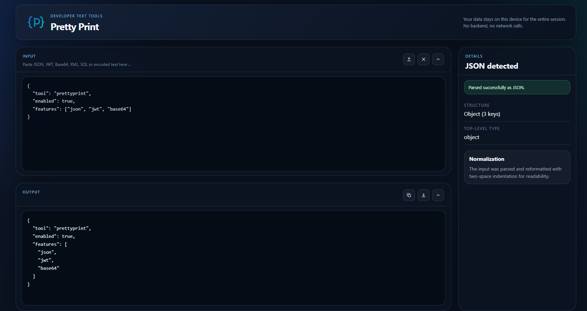

# Pretty Print

Pretty Print is a local-first developer text inspection tool. You paste or upload messy text, and the site detects the format, reformats it for readability, and shows extracted details without sending your data to any backend.

## What it supports

- JSON
- Stringified JSON
- JWT
- XML
- PEM certificates
- Base64
- URL-encoded text
- SQL

## How to use the site

Launch the site at [prettyprint.io](https://prettyprint.io).

1. Open the site in your browser.
2. Paste text into the `INPUT` panel, or use the upload icon to load a local file.
3. The app detects the most likely format automatically.
4. Review the formatted result in the `OUTPUT` panel.
5. Review extracted fields in the `DETAILS` panel.
6. Use the copy or download icons to export the formatted output.

## Screenshot

## Common workflows

### Inspect JSON or stringified JSON

Paste raw or escaped JSON to get pretty-printed output and basic shape details.

### Inspect a JWT

Paste a token to view decoded header and payload content locally in the browser.

### Inspect XML

Paste compact XML to get readable indentation and root document details.

### Inspect a PEM certificate

Paste a PEM certificate to view a CLI-style readable certificate summary in the output panel and the subject and issuer in the details panel.

### Decode Base64 or URL-encoded input

Paste encoded text to decode it and inspect the readable result.

## Privacy

All processing happens locally in your browser.

- No backend
- No network calls for parsing
- Uploaded files are read locally only

## Sample inputs

The repository includes sample files in [samples](./samples) for each supported format.

## GitHub Pages

This repository is configured to deploy automatically to GitHub Pages when changes are pushed to `main`.

For the custom domain to work, the GitHub repository Pages settings must use `prettyprint.io`, and your DNS must point the domain at GitHub Pages.
